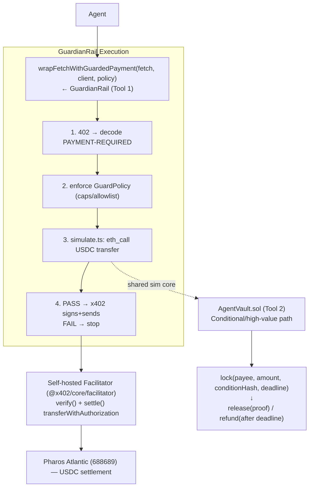

# PayGuard — PRD (Pharos Skill Hackathon, Phase 1)

> **One-liner:** x402 lets a Pharos agent *pay*. PayGuard makes sure it pays **safely** and **conditionally** — a CertiK-audited safety + escrow layer wrapping Pharos's official x402 rail.

**Submission shape:** an **Anthropic Agent Skill** (`SKILL.md`, matching the official `skills/x402-pharos` convention) + the runnable code it documents. Target: Phase 1 top-40 → Phase 2 Agent Arena.

---

## 1. Verified stack (locked to source, 2026-06-12)

| Item | Value | Source |
|---|---|---|
| Skill format | Anthropic Agent Skills `SKILL.md` (frontmatter + trigger phrases + code blocks) | official `skills/x402-pharos/SKILL.md` |
| Chain | Pharos Atlantic Testnet, **chain ID 688689**, CAIP-2 `eip155:688689` | SKILL.md |
| RPC | `https://atlantic.dplabs-internal.com` | SKILL.md |
| x402 packages | `@x402/core` `@x402/express` `@x402/fetch` `@x402/evm` (^2.0.0), `viem` ^2, `express` ^4 | SKILL.md package.json |
| USDC | 6 decimals, EIP-712 domain `version: "2"` (EIP-3009 `transferWithAuthorization`); test addr `0xE0BE08c77f415F577A1B3A9aD7a1Df1479564ec8` *(unofficial — confirm)* | docs + SKILL.md |
| Contracts | Solidity **0.8.28**, Foundry + Hardhat both supported | repo configs |
| Security rubric | **CertiK Skill Scanner** is an official judging standard | press (DailyCoin/Blockster/Benzinga) |

**Open recon (do first, in Pharos TG `t.me/+U27f5oGnJNlkZTI0`):**
1. Official **Facilitator URL** (or confirm none → we self-host, decided).
2. Canonical testnet **USDC address**.
3. `npm view @x402/core` — confirm scoped v2 names resolve (else fall back to Coinbase unscoped `x402-*`).
4. Faucet bump (default 0.01 PHRS/12h is too low for iterative testing).

---

## 2. Problem & thesis

x402 is an HTTP-402 pay-per-call rail. It has **no spend caps, no pre-flight simulation, no asset-spoofing protection, no conditional/escrowed release.** An autonomous agent looping over x402 endpoints can drain its wallet, pay a spoofed token contract, or pay for work it never receives. PayGuard is the missing safety + settlement layer — and it maps 1:1 onto the CertiK security criterion the hosts named.

## 3. Scope

**In (graded core):**
- **GuardianRail** — client-side payment interceptor (spend caps + policy + `eth_call` simulation) decorating the x402 client.
- **AgentVault** — minimal USDC escrow contract (`lock`/`release`/`refund`) for conditional/milestone payments.
- **Facilitator (Hybrid)** — configurable `FACILITATOR_URL` defaulting to Pharos's official URL, with a self-hosted fallback node we ship. Flip the env var if their infra hangs in the 11th hour → demo still settles.
- **SKILL.md** — the standardized Skill module wrapper.

**Out / deferred:**
- ❌ `IntentCompiler` (needs a DEX router ABI on a near-empty testnet → ecosystem-dependency trap).
- ❌ Streaming payments (block-timestamp math + reentrancy surface the scanner will flag, marginal demo value).
- 🟡 MCP server — **stretch** wrapper only if Day-4 time remains.

## 4. Architecture



GuardianRail and AgentVault **share `simulate.ts`** (both `eth_call` the USDC transfer) — two tools, one audited core.

## 5. Component specs

### 5.1 `SKILL.md` (deliverable wrapper)
Mirror the official frontmatter exactly:
```yaml
---
name: payguard
description: Safe x402 payments + conditional escrow for Pharos agents. Use when an
  autonomous agent pays for APIs/services via x402 and needs spend caps, pre-flight
  transaction simulation, asset-spoof protection, or milestone escrow on Pharos.
  Triggers on "safe x402", "agent spend cap", "x402 guardrail", "pharos escrow".
license: MIT
metadata: { author: <you>, version: "1.0.0" }
---
```
Body sections (match their structure): Network · When to Use · Quick Start · GuardPolicy config · **Complete Code Examples** (guarded client, facilitator, escrow) · Security Best Practices · **Attack→Blocked table** · Payment Flow · Resources.

### 5.2 GuardianRail — `src/guardrail.ts`
```ts
interface GuardPolicy {
  maxPerCall: bigint;          // USDC base units (6 dp)
  maxTotal: bigint;            // cumulative session budget
  allowedAssets: Address[];    // USDC allowlist — blocks asset spoofing
  allowedPayees?: Address[];
  blockedPayees?: Address[];
  maxPriceJumpX?: number;      // anomaly: reject price > N× rolling median
  simulate?: boolean;          // default true
  onViolation: "throw" | "skip";
}
interface GuardDecision { allowed: boolean; reason?: string; requirement: PaymentRequirement; simulated?: SimResult; spent: bigint; }

function wrapFetchWithGuardedPayment(fetch, client: x402Client, policy: GuardPolicy): typeof fetch;
```
Flow: intercept 402 → `decode PAYMENT-REQUIRED` → assert `asset ∈ allowedAssets`, `amount ≤ maxPerCall`, `spent+amount ≤ maxTotal`, payee allow/deny, price-anomaly → if `simulate`, `simulate.ts` → on pass, delegate to `wrapFetchWithPayment`; on fail, throw/skip per policy. Maintain an in-memory budget ledger; expose `getSpend()`.

### 5.3 `src/simulate.ts` (shared read-only core)
`eth_call` the USDC `transfer`/`transferWithAuthorization` from the agent to `payTo` (viem `publicClient.call` with state override for balance where needed); decode reverts; confirm sufficient balance, asset is a real ERC-20 at the allowlisted address, no blacklist revert. Returns `{ ok, revertReason?, gas? }`. Zero deploy risk.

### 5.4 `AgentVault.sol` (Solidity 0.8.28, Foundry)
```solidity
struct Escrow { address payer; address payee; uint256 amount; bytes32 conditionHash; uint64 deadline; Status status; }
function lock(address payee, uint256 amount, bytes32 conditionHash, uint64 deadline) external returns (uint256 id); // SafeERC20.transferFrom payer→vault
function release(uint256 id, bytes calldata proof) external;  // require keccak256(proof)==conditionHash; payer or releaser; pay→payee
function refund(uint256 id) external;                          // after deadline → payer
event Locked(uint256 id,...); event Released(uint256 id); event Refunded(uint256 id);
```
Rules: OZ `SafeERC20` + `ReentrancyGuard`; checks-effects-interactions (token transfer last); reject zero amount / past deadline; no double-spend (`Status` machine); **no streaming, no upgradeability, no delegatecall** → minimal attack surface for the scanner.

### 5.5 Facilitator (Hybrid) — `src/facilitator.ts`
`@x402/core/facilitator` + `@x402/evm` `toFacilitatorEvmSigner`. HTTP service exposing `verify` + `settle`; settle submits `transferWithAuthorization` on 688689 (signer funded with PHRS for gas). **Default `FACILITATOR_URL` to Pharos's official endpoint; fall back to this `localhost` node** if theirs hangs/rate-limits → guaranteed-green demo either way.

## 6. CertiK alignment (the differentiator — make it explicit in the README)
- Run **CertiK Skill Scanner on PayGuard itself** before submitting. A safety skill that fails the official scanner is fatal — this is a gate, not a nicety.
- README leads with the security posture: SafeERC20, ReentrancyGuard, no upgradeability, asset-allowlist, pre-flight simulation. Map each control to an attack it stops.

## 7. Test & bench plan (the "product is the repo" proof)
**Foundry (`AgentVault`):** happy-path lock/release/refund · access control (only payer/releaser) · deadline + double-release guards · reentrancy (malicious token) · SafeERC20 vs non-standard/fee-on-transfer tokens · zero-amount reject · **fuzz/invariant:** `Σ active locks == vault USDC balance`. Target 100+ assertions.
**GuardianRail bench (`tsx`/vitest):** a fixture table of malicious `PAYMENT-REQUIRED` payloads — over-cap, over-budget, **asset spoof** (wrong token), denied payee, price-spike, insufficient-balance(→sim revert) — assert each **blocked**; legit ones **pass**. Emit a markdown **Attack → Blocked?** table straight into the README.

## 8. Demo (≤90s)
1. Agent calls 3 x402 endpoints with a `maxTotal` budget → watch GuardianRail allow the first two, **hard-stop** the third (budget) and an **asset-spoof** attempt — on-chain tx hashes for the allowed ones.
2. High-value task → `lock()` into AgentVault → condition met → `release()`; show timeout → `refund()`.
3. Cut to the green `forge test` wall + the Attack→Blocked table + CertiK Skill Scanner pass.

## 9. Roadmap (today 06-12 → deadline 06-15, buffer 06-16/17)
- **Day 1 (12):** TG recon (facilitator/USDC/faucet); scaffold ESM+tsx+viem; stand up self-hosted facilitator + reference x402 server/client → **settle one real USDC payment green on 688689**. Lock package names.
- **Day 2 (13):** `simulate.ts` + `guardrail.ts` + `GuardPolicy`; bench harness + Attack→Blocked table.
- **Day 3 (14):** `AgentVault.sol` + full Foundry suite; deploy to 688689; receipt verification (`decodePaymentResponseHeader`) → escrow release path.
- **Day 4 (15):** author `SKILL.md` (frontmatter + complete code blocks); README w/ green wall; **run CertiK Skill Scanner**; record demo; submit. (16–17 buffer.)
- **Stretch:** thin MCP wrapper over guardrail+vault.

## 10. Phase 2 hook
PayGuard is the safety substrate for any Agent Arena entry: a "BountyHunter" agent that earns via x402 under a guardrail budget and escrows deliverables through AgentVault — same repo, one narrative continuation.

## 11. Risks
| Risk | Mitigation |
|---|---|
| No public facilitator | Self-host (decided) |
| `@x402/*` scoped names don't resolve | `npm view` Day 1; fall back to Coinbase unscoped `x402-*` |
| USDC lacks EIP-3009 | Confirm `transferWithAuthorization` on the test USDC; else deploy our own EIP-3009 mock USDC for the demo |
| Faucet too small | Request dev bump in TG Day 1 |
| Scanner flags our contract | Keep `AgentVault` minimal; scan before submit |
