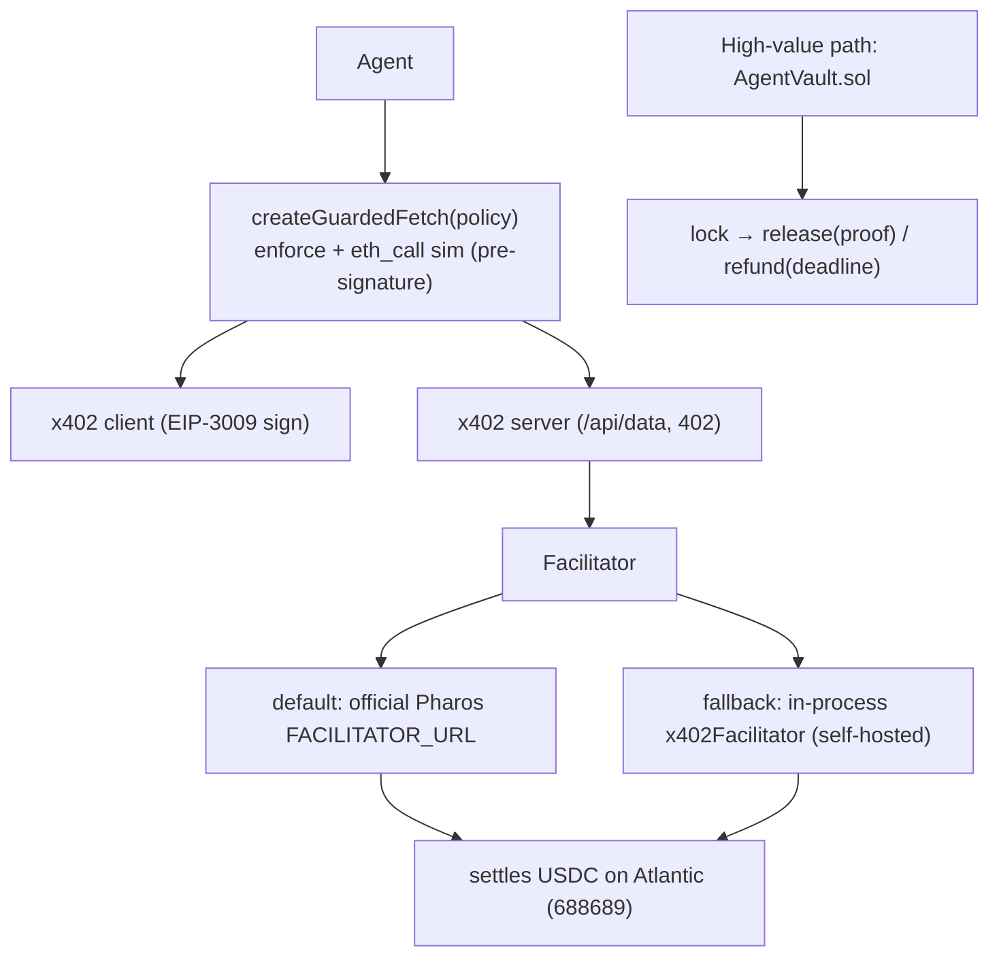

# 🛡️ PayGuard — Agentic Payment Security & Escrow for Pharos

> **The CertiK-grade seatbelt for x402.** Pharos's flagship payment rail lets autonomous
> agents pay for anything — but with no spend caps, no simulation, and no escrow, one LLM
> hallucination or a rogue endpoint can drain an agent's wallet in seconds. PayGuard is the
> safety layer x402 is missing: two composable, atomic Skills any Pharos agent can import.

**Pharos Skill-to-Agent Dual Cascade Hackathon · Phase 1** · Chain: Pharos Atlantic Testnet (`688689`)

[](https://github.com/edycutjong/payguard/actions/workflows/ci.yml)
[](https://github.com/edycutjong/payguard/actions/workflows/codeql.yml)
[](LICENSE)


```text
  🛡️  PayGuard · GuardianRail — Attack → Blocked
┌─────────┬─────────────────────────────────┬─────────────────┬─────────────────────┐
│ (index) │ Attack Vector                   │ Result          │ Guard Code          │
├─────────┼─────────────────────────────────┼─────────────────┼─────────────────────┤
│ 0       │ 1. The Drainer (10,000 USDC)    │ 🛑 BLOCKED      │ MAX_SPEND           │
│ 1       │ 2. The Phish (0xFakeToken)      │ 🛑 BLOCKED      │ INVALID_ASSET       │
│ 2       │ 3. The Rogue Node (bad payTo)   │ 🛑 BLOCKED      │ UNAPPROVED_PAYEE    │
│ 3       │ 4. The Revert (sim fails)       │ 🛑 BLOCKED      │ SIMULATION_FAILED   │
│ 4       │ 5. The Clean Run                │ ✅ AUTHORIZED   │ AUTHORIZED          │
└─────────┴─────────────────────────────────┴─────────────────┴─────────────────────┘
  ✅ 5/5 vectors handled correctly — 100% of unauthorized agent spends blocked.
```

---

## Why this matters

x402 (the official Pharos agent-payment protocol) will sign and settle **whatever** a server's
`402 PAYMENT-REQUIRED` demands. PayGuard wraps it with deterministic controls and conditional
escrow — and maps 1:1 onto the **CertiK Skill Scanner** security standard the hackathon judges by.

## Two Skills

### 🚦 Tool 1 — `GuardianRail` (pre-flight payment interceptor)
A client-side guard that enforces policy on the 402 offer **before** the agent signs the
EIP-3009 authorization. Nests under the x402 client via `createGuardedFetch`:

```ts
const guarded  = createGuardedFetch(fetch, policy, { rpcUrl });
const safeFetch = wrapFetchWithPayment(guarded, client);   // throws AgentSecurityError on violation
```
Enforces: canonical-asset (anti-spoof) · per-call cap · daily budget · payee allowlist · `eth_call` simulation.

### 🏦 Tool 2 — `AgentVault` (conditional USDC escrow)
Minimal, non-upgradeable, strict-CEI escrow (`SafeERC20` + `ReentrancyGuard`) for milestone payments:
`lock(payee, amount, conditionHash, deadline)` → `release(id, preimage)` / `refund(id)`.

## Architecture (Hybrid facilitator — "Option 3")


The in-process facilitator implements `FacilitatorClient` directly, so the self-hosted fallback
needs **no HTTP-facilitator service** — the demo is deterministic even if the public facilitator is down.

## ✅ Proven (reproducible)

```text
$ npm run bench          # GuardianRail — offline, deterministic
  ✅ 5/5 vectors handled correctly — 100% of unauthorized agent spends blocked.

$ forge test             # AgentVault — OZ v5.6.1 / solc 0.8.28
  [PASS] testFuzz_BalanceMatchesTotalLocked(uint256) (runs: 256)
  [PASS] test_ReentrancyGuardBlocksReentry()        … (+9 more)
  Suite result: ok. 11 passed; 0 failed; 0 skipped

$ npm run server & npm run demo    # full guarded payment, end-to-end on Atlantic
  ✅ paid + received: { secret: 'PayGuard: safe x402 payment settled on Pharos Atlantic.' }
  💰 budget remaining: 49999000     (GuardianRail authorized + decremented once)
  # receiver USDC balance 2000 → 3000 on-chain — a real settlement, not just a 200
```
The complete flow is verified **end-to-end on Atlantic**: a GuardianRail-guarded agent pays the
x402 server, the in-process facilitator verifies and **settles 0.001 USDC on-chain**, and the
agent receives the protected content — all on `@x402/*` v2.14.

## 🧪 Engineering harness

| Layer | Tool | Status |
|---|---|---|
| Type safety | `tsc --noEmit` | ✅ |
| Skill tests | GuardianRail attack bench (5 vectors) | ✅ 5/5 |
| Contract tests | Foundry — 256-run fuzz + reentrancy | ✅ 11/11 |
| On-chain E2E | guarded payment settles on Atlantic | ✅ |
| SAST (TypeScript) | CodeQL | ✅ |
| SAST (Solidity) | Slither | ✅ advisory |
| Secret scanning | TruffleHog (`--only-verified`) | ✅ |
| Supply chain | npm audit + Dependabot | ✅ |

A 3-stage GitHub Actions pipeline (**Quality · Security · Gate**) runs on every push/PR — see
`.github/workflows/ci.yml`. Locally: `npm run ci` (bench + Foundry) · `npm run typecheck` · `make security-scan`.

## Quick start

```bash
npm install
npm run bench                 # 5/5 GuardianRail attack table (offline)

# contracts (offline): install BOTH libs, then run the 11/11 suite
forge install foundry-rs/forge-std OpenZeppelin/openzeppelin-contracts
forge test

# on-chain (needs funded Atlantic testnet keys):
cp .env.example .env          # fill AGENT_PK, FACILITATOR_PK, RECEIVER_ADDRESS
forge script script/DeployMockUSDC.s.sol --rpc-url atlantic --broadcast   # prints MockUSDC address
#   ↳ paste that address into USDC_ADDRESS in .env
npm run probe                 # prove EIP-3009 settlement on Atlantic
npm run server                # terminal 1 — x402-protected resource server
npm run demo                  # terminal 2 — guarded agent pays end-to-end (settles 0.001 USDC)
```

## Security → CertiK mapping

| Control | Attack stopped |
|---|---|
| `targetAsset` strict-equality | token-spoofing / look-alike phishing |
| `maxSpendPerCall` + `dailyBudgetRemaining` | wallet draining via looping/hallucinating agents |
| `allowedPayees` allowlist | exfiltration to a rogue payee |
| `eth_call` pre-flight simulation | paying into reverts / paused / blacklisted contracts |
| `SafeERC20` + `ReentrancyGuard` + CEI | reentrancy / non-standard-token drains |
| minimal contract (no streaming/upgrade/delegatecall) | reduced scanner attack surface |

## Phase 1 deployment proof (Pharos Atlantic, 688689)

| Artifact | Value |
|---|---|
| MockUSDC (EIP-3009) | `0xe54205649D6d41Aa9cCdD5667eaDB62f1dFA84AC` |
| Settlement tx | `0x331ee3ff225c8b8a9725e457d8aa9978240a3504b018aa55fedd16680706ffd2` |

> Verified on-chain — `status: success`, block 24047421 on Pharos Atlantic (688689) via
> `https://atlantic.dplabs-internal.com/`.

## Repo layout

```
SKILL.md                     Anthropic Agent Skill (the submission artifact)
src/guardrail.ts             Tool 1 — createGuardedFetch + pure evaluateRequirement
src/simulate.ts              eth_call pre-flight (injectable)
src/rpc.ts                   rate-limit-hardened viem transport (retryingHttp)
src/facilitator.ts           in-process x402Facilitator (self-hosted fallback)
src/server.ts                x402-protected resource server
src/demo.ts                  end-to-end guarded payment
src/probe.ts                 EIP-3009 settlement probe
contracts/AgentVault.sol     Tool 2 — conditional escrow
contracts/MockUSDC.sol       EIP-3009 test USDC
script/DeployMockUSDC.s.sol  deploy MockUSDC → USDC_ADDRESS
test/AgentVault.t.sol        11/11 Foundry suite (fuzz + reentrancy)
bench/malicious_bench.ts     5/5 attack-vector bench
```

## Stack

`@x402/*` v2.14 · `viem` v2.52 · `express` · Foundry (solc 0.8.28, OZ v5.6.1) · TypeScript/ESM. MIT.
